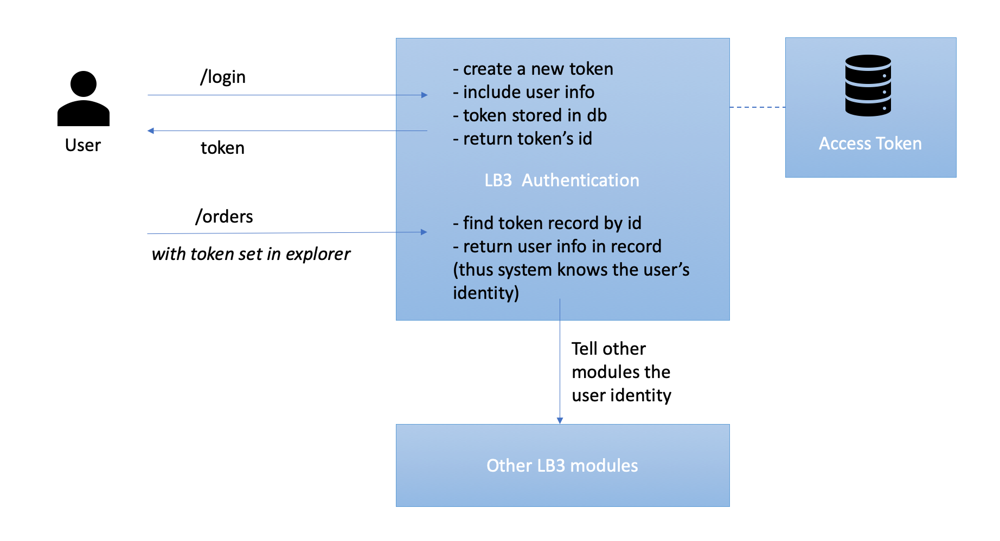
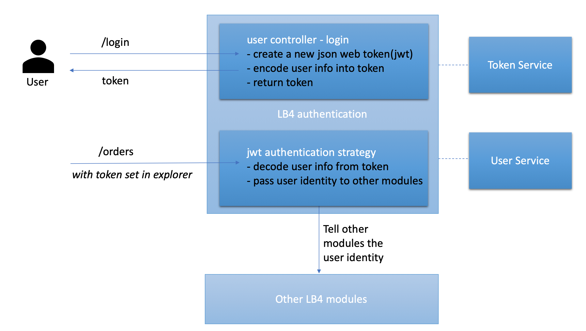

This is a guide to describe how to migrate LoopBack 3 built-in User/AccessToken
model based authentication.

As the pre-work of this guide, we created an application completely migrated
from
[`loopback-example-access-control`](https://github.com/strongloop/loopback-example-access-control).
It builds with a LoopBack 4 authentication system based on
`@loopback/authentication` and an authorization system based on
`@loopback/authorization`. Our migration guide will use it as the reference. A
token based authentication module(prototype) is also exported as a component in
the example for users to leverage.

## LoopBack 3 Authentication

You can take a few minutes on reading
[this page](https://loopback.io/doc/en/lb3/Introduction-to-User-model-authentication.html)
to recall the authentication system in LoopBack 3.

LoopBack 3 provides a built-in `User` model, which can be easily migrated to
LoopBack 4 by `lb4 import-lb3-models`. It also provides an `AccessToken` model
to store a logged in user's information. Its authentication system's mechanism
is:

When a user logs in, the system:

- creates a new access token
- the token includes user info as attributes
- stores the token in a database
- returns token's id

After setting the token in the explorer, subsequent requests will include the
token in their headers, the system:

- finds token record by id
- returns the user info in the record
- passes user info to other modules in the system

Here is the diagram that describes the system:



## LoopBack 4 Authentication

We highly recommend you read and understand the document of LoopBack 4
authentication system before the migration:

- [Introducing component `@loopback/authentication`](https://loopback.io/doc/en/lb4/Loopback-component-authentication.html)
- [Tutorial of how to secure your LoopBack 4 APIs with jwt strategy](https://loopback.io/doc/en/lb4/Authentication-Tutorial.html)

As a summary for the above documents: LoopBack 4 has a more flexible
authentication module that can potentially support any authentication
strategies, not only the token based one. To get an equivalent authentication
system in your LoopBack 4 application, you can achieve that easily and fast by
migrating the LoopBack 3 `User` model and plugging in a prototype JWT
authentication component to perform the user login, and to verify a user's
identity by token.

Here is a diagram that illustrates the scenario in LoopBack 4, boxes with a
darker blue color emphasize its differences from LoopBack 3.



As you could tell from the diagram, the concept of `User` stays the same, the
differences of the core authentication module mostly come from:

- LoopBack 3 provides persistency for access token, whereas our prototype
  doesn't store it yet.
- LoopBack 4 JWT token encodes all attributes and returns the token, but
  LoopBack 3 `AccessToken` stores such attributes in a database, and only
  exposes `id` as the returned token.
- LoopBack 4 decouples user and token utilities into services to keep the logic
  simple in the controllers and strategies.

Next let's take a look of the migration steps to get prepared:

- migrates model definitions for model `User`
- provides persistency for `User`
- creates a login controller
- mounts the JWT authentication component, which mainly includes:
  - a token service to generate and validate access tokens
  - an authentication strategy to validate the user identity

### Migrating model definitions

_A LoopBack 3 model provides 3 layers: data shape, persistency, REST APIs,
whereas LoopBack 4 model only describes the data shape. You need to create a
model, a repository, a controller for `User` to get an equivalent LoopBack 3
`User` model. You can read about the differences in document
[migrating model definitions and built-in APIs](../models/core.md)._

Let's migrate the model definition first. You can run `lb4 import-lb3-models` to
create an equivalent LoopBack 4 model `User`.

Import model `User` by the migration CLI:

```sh
$ cd myLB4App
$ lb4 import-lb3-models <path_to_loopback-example-access-control>
```

Choose `User` for the prompt. It will be created under `src/models`.

You may notice that the `User` model contains `password` as its property. While
a more secured practice is separating the sensitive information from the `User`
model. Therefore in this guide we:

- remove property `password` from the `User` model
- create a new model called `UserCredentials` to store the password. It belongs
  to model `User`. Below is the command to create `UserCredentials`.

```sh
$ lb4 model
? Model class name: UserCredentials
? Please select the model base class Entity (A persisted model with an ID)
? Allow additional (free-form) properties? Yes
Model UserCredentials will be created in src/models/user-credentials.model.ts

Lets add a property to UserCredentials
Enter an empty property name when done

? Enter the property name: id
? Property type: number
? Is id the ID property? Yes
? Is id generated automatically? No
? Is it required?: Yes
? Default value [leave blank for none]:

Lets add another property to UserCredentials
Enter an empty property name when done

? Enter the property name: password
? Property type: string
? Is it required?: Yes
? Default value [leave blank for none]:

Lets add another property to UserCredentials
Enter an empty property name when done

? Enter the property name: userId
? Property type: number
? Is it required?: Yes
? Default value [leave blank for none]:

Lets add another property to UserCredentials
Enter an empty property name when done

? Enter the property name:
   create src/models/user-credentials.model.ts
   update src/models/index.ts

Model UserCredentials was created in src/models/
```

### User Persistency and CRUD APIs

First let's create a memory datasource that inherits from LoopBack 3 for data
storage.

```sh
$ lb4 datasource
? Datasource name: db
? Select the connector for mysqlDs: In-memory db (supported by StrongLoop)
? window.localStorage key to use for persistence (browser only):
? Full path to file for persistence (server only):
```

Then create the corresponding repositories for `User` and `UserCredentials`:

```sh
cd myLB4App
$ lb4 repository
? Please select the datasource DbDatasource
? Select the model(s) you want to generate a repository User, UserCredentials
? Please select the repository base class DefaultCrudRepository (Legacy juggler bridge)
```

Create the user controller for CRUD operations:

```sh
$ lb4 controller
? Controller class name: User
Controller User will be created in src/controllers/user.controller.ts

? What kind of controller would you like to generate? REST Controller with CRUD functions
? What is the name of the model to use with this CRUD repository? User
? What is the name of your CRUD repository? UserRepository
? What is the name of ID property? id
? What is the type of your ID? number
? Is the id omitted when creating a new instance? No
? What is the base HTTP path name of the CRUD operations? /users
   create src/controllers/user.controller.ts
   update src/controllers/index.ts

Controller User was created in src/controllers/
```

### Creating Login Function

_Migrating all functions for User need more effort, this section only create
login function as the minimum requirement._

For token based authentication, a user logs in by providing correct credentials
(email and password) in the payload of endpoint `User/login`, then gets a token
back with its identity information encoded and includes it in the header of next
requests.

Let's add a new controller function `login` decorated with the REST decorators
that describe the request and response (see
[the complete user controller file](https://github.com/strongloop/loopback-next/tree/master/examples/access-control-migration/src/controllers/user.controller.ts)).

The core logic of `login` does 3 things:

- verifies the credentials and find the right user.
  - calls `userService.verifyCredentials()` to do it.
- converts the user into a standard principal shared across the authentication
  and authorization modules.
  - calls `userService.convertToUserProfile()` to do it.
- encodes the principal that carries the user's identity information into a JSON
  web token.
  - calls `jwtService.generateToken()` to do it.

As you could see, the login function is pretty light, all the complex utilities
are implemented by services. This also decouples the responsibilities. We will
create the token and user service in the next section.

### Mounting Authentication Component

The authentication component is temporarily kept in the
[example repository](https://github.com/strongloop/loopback-next/tree/master/examples/access-control-migration/src/components/jwt-authentication).
It includes all the services that verify a user's identity and manage the tokens
and users. We plan to extract this prototype component into a standalone package
in story [to be created](). Now you can import it from the example as a
workaround.

As token based authentication, the component uses the JWT authentication
strategy to verify a user's identity. The authentication setup is borrowed from
[loopback4-example-shopping](https://github.com/strongloop/loopback4-example-shopping/tree/master/packages).
The authentication system aims to understand **who sends the request**. It
retrieves the token from a request, decodes the user's information in it as
`principal`, then passes the `principal` to other modules like authorization
which will decide the `principal`'s access later.

To simplify the implementation for readers, we provide a brief introduction of
the extracted services and bindings instead of unfolding all the implementation
details. You can find a very detailed steps of creating it in
[this tutorial](https://loopback.io/doc/en/lb4/Authentication-Tutorial.html).

The component consists of the following files:

- creating the jwt authentication strategy to decode the user profile from
  token. See file
  [jwt.auth.strategy.ts](https://github.com/strongloop/loopback-next/tree/master/examples/access-control-migration/src/components/jwt-authentication/jwt.auth.strategy.ts).
- creating the token service to organize utils for token operations. See file
  [jwt.service.ts](https://github.com/strongloop/loopback-next/tree/master/examples/access-control-migration/src/components/jwt-authentication/jwt.service.ts).
- creating user service to organize utils for user operations. see file
  [user.service.ts](https://github.com/strongloop/loopback-next/tree/master/examples/access-control-migration/src/components/jwt-authentication/user.service.ts).
- adding OpenAPI security specification to your app so that the explorer has an
  Authorize button to setup the token for secured endpoints. See file
  [security.spec.ts](https://github.com/strongloop/loopback-next/tree/master/examples/access-control-migration/src/components/jwt-authentication/security.spec.ts).
- creating bindings for the above services. See file
  [keys.ts](https://github.com/strongloop/loopback-next/blob/master/examples/access-control-migration/src/components/jwt-authentication/keys.ts).

You can enable the jwt authentication by mounting the authentication component
in the application constructor:



```ts
// Add this line to import the component
import {JWTAuthenticationComponent} from './components/jwt-authentication';

export class AccessControlApplication extends BootMixin(
  ServiceMixin(RepositoryMixin(RestApplication)),
) {
  constructor(options: ApplicationConfig = {}) {
    // ...
    // Add this line to mount the jwt authentication component
    this.component(JWTAuthenticationComponent);
    // ...
  }
}
```
